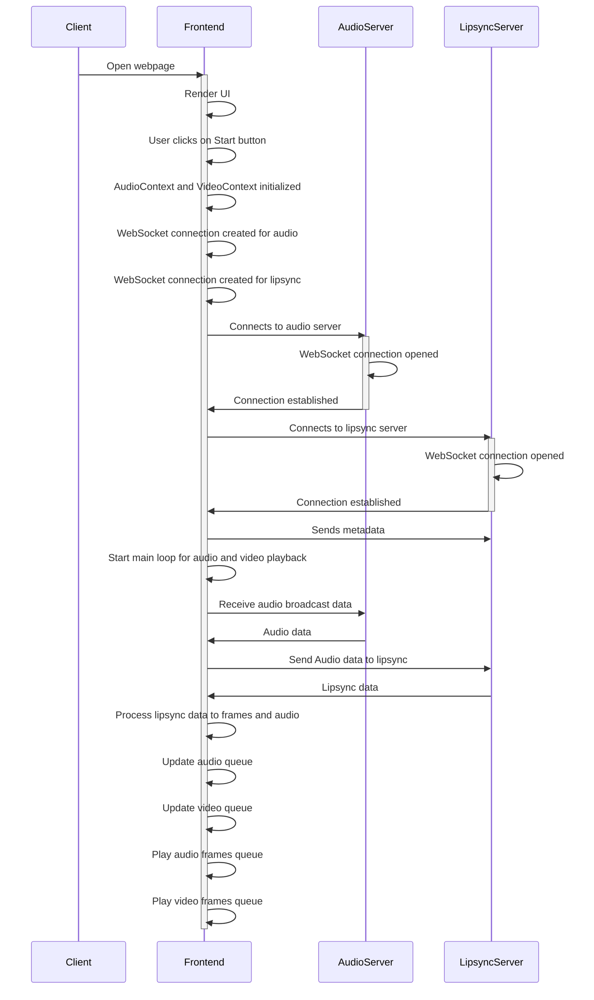

# simli-next-js-demo

In this demo we are using webhooks to stream incoming audio from a [radio broadcast](https://radio.talksport.com/stream) to `ws://api.simli.ai/LipsyncStream` which returns lipsynced video and audio frames to be displayed on frontend

Websocket schema: [Click here](https://github.com/simliai/simli-next-js-demo/blob/main/Websockets.md)



## Usage

### Terminal 1: (AudioServer)

1. Install python modules

Linux
```bash
python3 -m venv .venv
source .venv/bin/activate
pip install -r requirements.txt
```

Windows
```bash
pip install -r requirements.txt
```

2. run radio broadcast websocket server
```bash
python app.py
```

### Terminal 2: (Frontend)
Open another terminal
1. Install packages
```bash
npm install
```

2. Start
```bash
npm run dev
```
