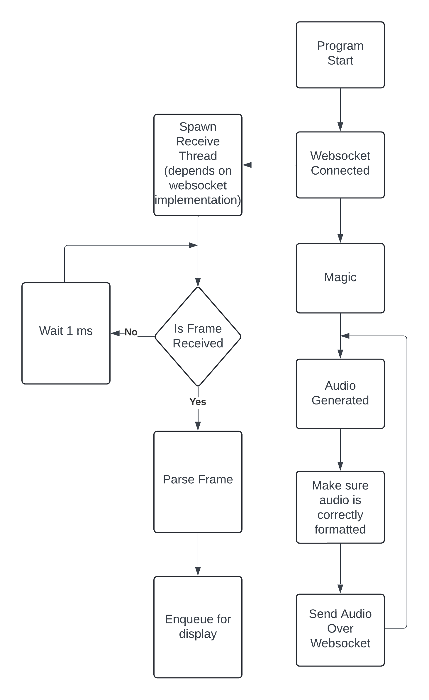

# Simli LipsyncStream Endpoint

## What does this endpoint do?

This endpoint is a websockets endpoint that takes in a stream of PCM16 audio frames and returns a stream of lipsync frames in a custom format. A custom player must be created. You can follow this document for how to decode the response. Also, this repo is a working example of how to render the Video and Audio using OpenCV and PyAudio.

## Client Flowchart



## Initial Request Format

The first request after initializing the websocket connection should be a JSON object with the following fields:

```json
{
    "video_reference_url": "CHARACTER_VIDEO_URL",
    "face_det_results": "FACE_DETECTION_RESULTS",
    "isJPG": true,
    "syncAudio": true
}
```

- `video_reference_url`: The URL of the video file that the lipsync frames will be rendered on. This follows the format of `https://storage.googleapis.com/charactervideos/CHARACTER_ID/CHARACTER_ID.mp4`
- `face_det_results`: The URL of the face detection results file. This follows the format of `https://storage.googleapis.com/charactervideos/CHARACTER_ID/CHARACTER_ID.pkl`
- `isJPG`: A bool to encode the video frames in JPG format. If false, the frames will be sent as RAW matrix representation with shape 512x512x3 which is not recommended for most cases.
- `syncAudio`: When set to true 34ms of Audio will be sent back with each frame. This is useful for syncing the audio with the video. If set to false, only the frames will be sent and you will have to sync the audio yourself.

## Audio Input Format

The audio frame is the bytes representation of the PCM16 audio frame. The audio frame is always 16000Hz mono. The lipsync will be wrong if there's a mismatch in the audio sampling rate or channel count. As of right now not other configs are possible.
The number of bytes will always be an even number. For example 255ms of audio will be 16000 \* 2 \* 0.255 = 8160 bytes. The minimum audio chunk size is 250ms to avoid frequent websocket calls.

If there's nothing to send, you must send a zero value byte array of length 250ms \(0.25 \* 2 \* \* 16000 = 8000 bytes\) to keep receiveing frames. No input mode currently not implemented and not sending anything will break your app.

## Response Format

The response format changes based on the `syncAudio` field in the request. The response is a binary encoded format that follows this structure:

- 5 bytes (str): `VIDEO`
- 4 bytes (int32): number of bytes in the video frame with the following format:
- v bytes: Video frame with metadata
  - 4 bytes(int32): frame index
  - 4 bytes(int32): frame width
  - 4 bytes(int32): frame height
  - f bytes (byte array): video frame bytes
- 5 bytes (str): `AUDIO`
- 4 bytes (int32): number of bytes in the audio frame
- a bytes (int16): audio frame

The video frame is a JPG image if `isJPG` is set to true. This means that it must be decoded accordingly depending on the language you are using. If set to false, the video frame will be a raw matrix representation with shape 512x512x3.
Audio is always pcm 16bit 16000Hz mono.

If `syncAudio` is set to false, the response will only contain the video frame. Which is specefied in the `v bytes` field.
